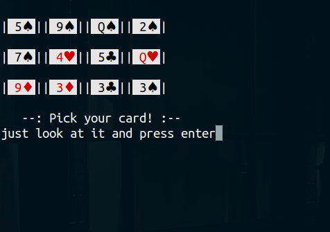
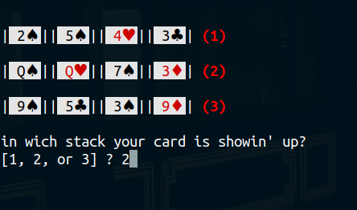

# Magic-Card-Game
A simple terminal magic game created with C++.
## Table of contents
* [Install](#Install)
* [Screenshots](#Screenshots)
## Install
* Clone/Download this repo.
* Install gcc compiler: `sudo apt install gcc`
* Move into Guess_card_game directory.
* Compile the script: `g++ guess_card_main.cpp i_guess_your_card-NEW-.cpp -o guess_card_game`
* And run the file: `./guess_card_game`
### Screenshots

